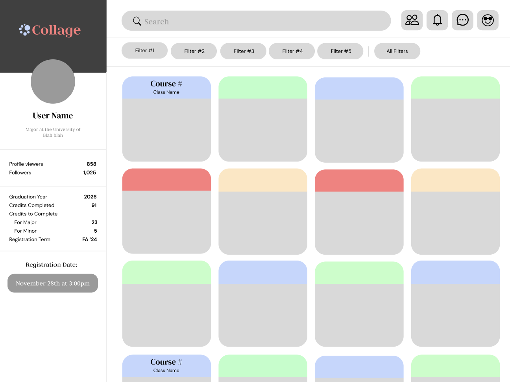
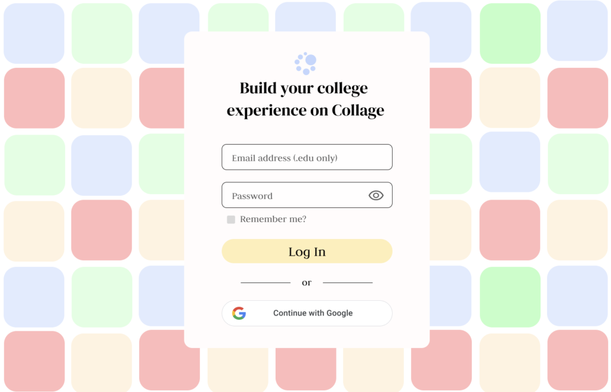

<!-- Improved compatibility of back to top link: See: https://github.com/othneildrew/Best-README-Template/pull/73 -->

<!--
*** Thanks for checking out the Best-README-Template. If you have a suggestion
*** that would make this better, please fork the repo and create a pull request
*** or simply open an issue with the tag "enhancement".
*** Don't forget to give the project a star!
*** Thanks again! Now go create something AMAZING! :D
-->

<!-- PROJECT SHIELDS -->
<!--
*** I'm using markdown "reference style" links for readability.
*** Reference links are enclosed in brackets [ ] instead of parentheses ( ).
*** See the bottom of this document for the declaration of the reference variables
*** for contributors-url, forks-url, etc. This is an optional, concise syntax you may use.
*** https://www.markdownguide.org/basic-syntax/#reference-style-links
-->
<!-- [![Contributors][contributors-shield]][contributors-url]
[![Forks][forks-shield]][forks-url]
[![Stargazers][stars-shield]][stars-url]
[![Issues][issues-shield]][issues-url] -->
<!-- [![License][license-shield]][license-url] -->
<!-- [![LinkedIn][linkedin-shield]][linkedin-url] -->

<!-- PROJECT LOGO -->
 

  
<h3 align="center">Collage</h3>
  

    A Platform for Personalized Course Planning and AI Academic Advising,
  

  

    Made by College Students, for College Students
  

## Collage Codebase Announcement

**⚠️ Currently, because of security reasons, we made our repositories private.**

Internally, we keep: 

- Collage's `Next.js` frontend codebase
- Collage's Python `Flask` backend codebase
- Collage's mobile platform codebase
- our own Internal Data Framework used for fetching and parsing LLM RAG data
- deprecated JS `React` codebase

<!-- ABOUT THE PROJECT -->
## About the Platform

### Platform Demo

  
  

### Collage is College Redefined

*Higher education is at a crossroads*. The traditional college class is becoming increasingly obsolete as we’ve witnessed lower attendance and lower grades, and the amount of students using generative AIs like ChatGPT to complete their work has skyrocketed. The way college operates is rapidly evolving and that is largely due to one key development in consumer demand: personalization.

From the TikTok for you page to the Amazon marketplace, a personalized user experience has become a top priority for highly successful companies looking to keep their customers engaged. Consumers want products and services that are personally tailored to their wants and needs. The same goes for college students with their education.

If universities want their students to reengage they need to personalize the user experience. Colleges need to start looking at themselves not solely as educational institutions, but as tech and social media companies as well.

This is the guiding mission of Collage. Collage is an education technology platform that uses artificial intelligence and social media to help students craft personalized class schedules, explore career paths, and make informed decisions about their education. We are a student-run startup striving to give students around the world a more equitable, enjoyable, and personalized college experience.

<!-- [![Product Name Screen Shot][product-screenshot]](https://example.com) -->
#### Never Stress about Class Scheduling Again

Collage is here to completely overhaul your registration process.

#### Personalized Course Planning

Courses best fit to enhance your college experience will be recommended to you through an infinite scrolling system.

#### AI Academic Advising
Our custom Large Language Model (LLM) is fine tuned to help you plan your perfect class schedule with ease.

> More information about the company and the platform can be found here [mycollage.us](https://mycollage.us/).
